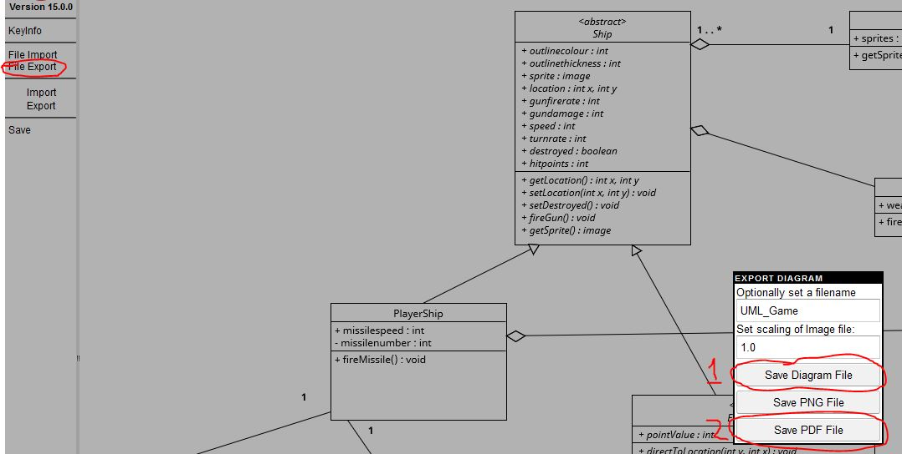

## 2023-group-19

### The Game

I've now started on the game, files are [here](game/src/sectorstar) Theres an additional folder holding the game images under `game/resources` so `git pull` the repo into your personal machine and you can make edits.

### Index
#### [UML Diagram](#uml) 
#### [Paper Prototype](#paper-prototype)
#### [Lecture Notes](#lecture-notes)

### UML

I've uploaded the [UML diagram](game/UML/UML_Game.pdf), when editing it please download the included [import file](game/UML/UML_Game.uxf) to https://www.umletino.com/umletino.html and then reupload the changes _**INCLUDING**_ the new Diagram file:

---
### Paper Prototype

The paper prototype video is now up [link here](ideas/paperprototype_link)
And the use-case diagram is also up: [image](usecase_diag/UCD_Starsector.pdf). And you can also download and change the diagram file and update it if you wish.

---

### Lecture Notes
I've moved my notes over to the [wiki](../../wiki) if anyone's interested. Ill be adding to it as we get further into the unit
